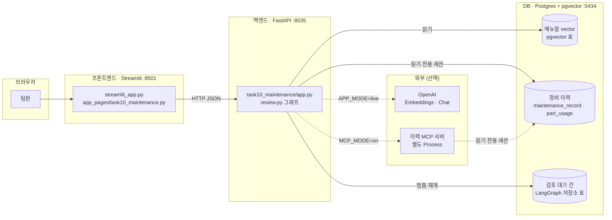
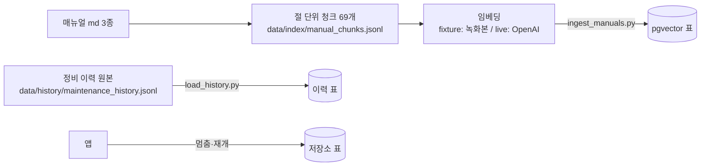
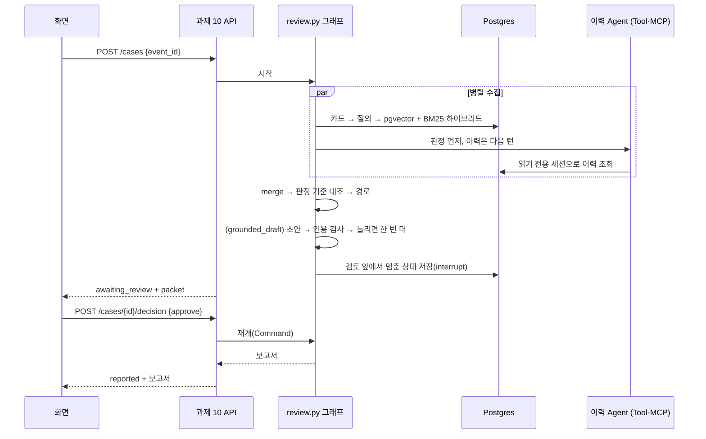

# 실행 가이드 — 과제 10 을 띄우고 확인하기

## 0. 한눈에 보는 구조

Process 들이 HTTP 로만 이야기한다. 화면은 서버 내부를 import 하지 않는다.
**DB 는 Postgres(pgvector 확장 포함) 하나다.**



**읽는 법**

- 실선은 항상 일어나는 연결, 점선은 설정을 켰을 때만 생기는 연결이다.
- **업무 데이터(매뉴얼 vector·정비 이력)는 앱이 읽기만 한다.** 적재는 스크립트가 한 번 한다(§2).
  앱이 쓰는 것은 자기 검토 대기 건(멈춘 그래프 상태)뿐이다.
- **API 키는 필요 없다(fixture).** 매뉴얼 의미 검색은 실제 OpenAI 임베딩을 녹화해 둔 것으로 적재·검색해서
  키 없이도 **진짜 순위**다.
- MCP 서버는 앱이 필요할 때 **자식 Process 로 직접 띄운다.** 따로 실행하지 않는다.
- Notebook 은 DB 를 쓰지 않는다. Notebook 안에서 작은 연습 저장소를 잠깐 만든다(§10).

---

## 1. 준비물

> **Windows 를 쓴다면 먼저 읽는다.** 이 문서의 명령은 환경 변수를 명령 앞에
> 붙이지 **않는다.** 그 문법은 macOS·Linux 에서만 동작한다. 대신 **필요한
> 값은 전부 `.env` 에 적고** 아래 명령을 그대로 쓴다. 세 운영체제에서 같다.

| 필요한 것 | 확인 |
|---|---|
| Python 3.13 | `uv` 가 알아서 맞춘다 |
| `uv` | `uv --version` |
| Docker | `docker ps` — **DB(Postgres)를 띄우는 데 필요하다** |
| OpenAI API 키 | `live` 모드에서만 |

```bash
git clone <이 저장소>
cd agent-10
uv sync --frozen        # lockfile 그대로 설치한다. 여기서 막히면 그 다음은 볼 것도 없다.
```

### uv 없이 pip 으로

`uv` 를 쓸 수 없는 환경이면 `requirements.txt` 를 쓴다. 두 파일 모두
`uv.lock` 에서 생성한 것이라 버전이 같다.

```bash
python3.13 -m venv .venv
source .venv/bin/activate          # Windows: .venv\Scripts\activate
pip install -r requirements.txt        # 실행만
pip install -r requirements-dev.txt    # 테스트·Jupyter 까지
```

이 뒤의 명령은 `uv run ...` 으로 적었다. pip 으로 설치했다면 가상환경을
활성화한 뒤 `uv run` 을 떼고 실행하면 된다.

### 설정 파일 만들기

```bash
cp .env.example .env
```

`.env` 를 열어 채운다. **`.env` 는 Git 에 올라가지 않는다. 실제 키는 여기에만 둔다.**

| 변수 | 무엇 | 언제 필요한가 |
|---|---|---|
| `APP_MODE` | `fixture` 또는 `live` | 항상 (기본 `fixture`) |
| `OPENAI_API_KEY` | 실제 키 | `live` 일 때만 |
| `OPENAI_MODEL` | 초안·Tool 선택 모델 (기본 `gpt-4.1-mini`) | `live` 에서 바꿀 때 |
| `OPENAI_EMBEDDING_DIMENSIONS` | live 임베딩 차원 (기본 1536) | 적재와 질의가 **같아야** 한다. fixture 는 녹화된 256 차원 |
| `POSTGRES_PASSWORD` | 아무 강한 문자열 | 항상. DB 를 처음 만들 때 이 비밀번호가 정해진다 |
| `DATABASE_URL` | `...task10:<비밀번호>@127.0.0.1:5434/task10` | 항상. 비밀번호가 `POSTGRES_PASSWORD` 와 같아야 한다 |
| `MCP_MODE` | `off`/`on` | 이력 Tool 을 MCP 서버에서 가져올 때 |

---

## 2. 제일 빠른 길 — fixture 모드

**API 키는 필요 없다.** 처음이라면 여기서 시작한다. 먼저 DB 를 띄우고 한 번 적재한다.

```bash
docker compose --env-file .env up -d db                          # Postgres + pgvector, 127.0.0.1:5434
uv run --env-file .env python scripts/task10/ingest_manuals.py   # 매뉴얼 청크 69개 → pgvector
uv run --env-file .env python scripts/task10/load_history.py     # 정비 이력 410건 → Postgres 표
```

적재는 **한 번이면 된다.** DB 데이터는 Docker 볼륨에 남아 컴퓨터를 껐다 켜도 그대로다.
다시 돌려도 같은 결과로 덮어쓴다(쌓이지 않는다). 그다음 앱과 화면을 띄운다.

```bash
# 터미널 1 — API
uv run uvicorn task10_maintenance.app:app --port 8035 --env-file .env --loop task10_maintenance.loop:selector_loop_factory
# 터미널 2 — 화면
uv run streamlit run streamlit_app.py
```

`--env-file .env` 가 모드와 설정을 읽는다. 그래서 명령 앞에 환경 변수를 붙일
필요가 없고, Windows 에서도 그대로 동작한다.

**`--loop task10_maintenance.loop:selector_loop_factory` 를 빼지 않는다.** 검토 대기 건 저장소는
psycopg 의 비동기 연결을 쓰는데, psycopg 는 Windows 의 기본 이벤트 루프(Proactor)를 거부한다.
빼면 Windows 에서 "검토 대기 건 저장소(Postgres)를 열 수 없습니다 (InterfaceError …ProactorEventLoop…)"
503 이 난다. macOS·Linux 는 원래 이 루프라 붙여도 바뀌는 것이 없다. 그래서 모든 OS 에서 같은 명령을 쓴다.

브라우저에서 **http://127.0.0.1:8501** 을 연다. 대표 사례 S01~S10 중 하나를 골라
"처리 시작" → 정비 기술자 결정 → 보고서까지 가 본다. '평가' 탭에서 시스템 재현율을 본다.

화면 없이 API 만 볼 수도 있다. **http://127.0.0.1:8035/docs** 가 OpenAPI 화면이다.

```bash
curl -s -X POST localhost:8035/cases -H "content-type: application/json" -d "{\"event_id\":\"EVT-2025-0034\"}"
curl -s -X POST localhost:8035/cases/<case_id>/decision -H "content-type: application/json" -d "{\"decision\":\"approve\",\"reviewer_role\":\"정비 기술자\"}"
```

### fixture 에서 무엇이 진짜이고 무엇이 대본인가

| 부분 | fixture | 이유 |
|---|---|---|
| **판정 기준·처리 경로·초안 검사** | **진짜** | 코드가 계산한다 |
| **정비 이력 조회(Tool 실행)** | **진짜** | Postgres 의 실제 이력 표를 읽는다 |
| **매뉴얼 검색 순위** | **진짜** | 실제 OpenAI 임베딩을 녹화해 두고 그것으로 적재·검색한다 |
| **멈춤·재개·보고서** | **진짜** | LangGraph 가 실제로 멈추고, 상태가 Postgres 에 남는다 |
| 이력 Agent 가 무엇을 부를지 고르는 것 | 대본 | 모델 대신 정해진 순서로 부른다 |
| 초안 문장 | 대본 | 근거에서 정해진 규칙으로 쓴다(`drafted_by = fixture_script`) |

`GET /diagnostics` 가 이것을 그대로 알려 준다(`tool_choice`, `drafted_by`, `embedding_source`, `database`).

---

## 3. 진짜로 — live 모드

실제 OpenAI 임베딩과 모델을 쓴다(비용이 든다). **`.env` 에 두 줄이면 된다.**

```
APP_MODE=live
OPENAI_API_KEY=sk-...
```

live 임베딩으로 매뉴얼을 한 번 다시 적재한 뒤(§2 의 `ingest_manuals.py` 같은 명령), 같은 명령으로 띄운다.
fixture 와 live 는 컬렉션이 따로라(`task10-manuals-recorded-256`, `task10-manuals-live-1536`) 섞이지 않는다.
정비 이력은 다시 적재하지 않아도 된다.

```bash
curl -s localhost:8035/health
# {"status":"ok","project":"task10","mode":"live"}
```

`mode` 가 `live` 가 아니면 `--env-file .env` 를 빠뜨렸거나, 셸에 `APP_MODE` 가
이미 설정되어 있는 것이다. **셸 환경 변수가 `.env` 보다 우선한다.**

live 에서는 이력 Agent 가 스스로 Tool 을 고르고 초안을 실제 모델이 쓴다. 응답의
`filled_history_types` 가 비어 있지 않으면 모델이 필요한 이력을 빠뜨려 코드가 채운 것이다.

---

## 4. DB — Postgres 하나

pgvector 는 별도 DB 가 아니라 **Postgres 안에 설치하는 확장**이다. 그래서 데이터베이스 하나에
일반 표와 vector 표가 함께 있다.

| 표 | 내용 | 누가 쓰나 |
|---|---|---|
| `langchain_pg_collection`, `langchain_pg_embedding` | 매뉴얼 청크 69개와 vector | `ingest_manuals.py` 가 적재, 앱은 읽기 |
| `maintenance_record`, `part_usage` | 정비 이력 410건과 교체 부품 | `load_history.py` 가 적재, 앱은 **읽기 전용 세션** |
| `checkpoints` 등 LangGraph 저장소 표 | 검토 대기 건(멈춘 그래프 상태) | 앱이 처음 켤 때 만들고 쓴다 |



- 정비 이력의 원본은 JSONL 파일이고, DB 표는 그것을 적재한 것이다. 원본을 고치면 `load_history.py` 를 다시 돌린다.
- 매뉴얼을 고쳤는데 다시 적재하지 않으면, 앱이 청크 수가 다르다며 503 과 적재 명령을 돌려준다.
- 이력 연결은 **읽기 전용 세션**이다. 쓰기 문장은 DB 가 거부한다.
- BM25(단어 검색)는 DB 가 아니라 단어 통계라 앱이 켤 때 청크 파일로 메모리에 다시 계산한다.

DB 안을 직접 보고 싶으면:

```bash
docker compose exec db psql -U task10 -d task10 -c "\dt"
```

---

## 5. 컨테이너로 한 번에

```bash
docker compose --env-file .env up -d --build
docker compose ps
```

네 서비스가 순서대로 뜬다. 전부 `127.0.0.1` 에만 바인딩한다.

| 서비스 | 하는 일 | 포트 |
|---|---|---|
| `db` | Postgres 16 + pgvector | 5434 |
| `init` | 매뉴얼 청크와 정비 이력을 적재하고 끝난다(§2 의 적재 두 줄과 같다) | — |
| `task10` | 과제 10 API | 8035 |
| `ui` | 화면 | 8501 |

`.env` 에 `POSTGRES_PASSWORD` 가 있어야 한다. 컨테이너끼리는 서비스 이름(`db`)으로 붙으므로
`.env` 의 `DATABASE_URL` 은 컨테이너에서 쓰지 않는다. 로컬(§2)과 컨테이너는 **같은 `db`** 를 쓴다.
검토 대기 건도 DB 에 있어 `docker compose restart task10` 뒤에도 이어 간다. 컨테이너에서 live 를 쓰려면
`.env` 에 `APP_MODE=live`, `OPENAI_API_KEY` 를 넣고 다시 띄운다(`init` 이 live 임베딩으로 다시 적재한다).

내릴 때:

```bash
docker compose down            # DB 볼륨은 남는다
docker compose down -v         # DB 데이터까지 지운다 (다음에 다시 적재)
```

---

## 6. 선택 기능 — MCP

> **Windows 로컬 실행에서는 쓸 수 없다.** 위의 Selector 루프는 Windows 에서 하위 Process 를
> 띄우지 못한다. Windows 에서 MCP 를 보려면 Docker(§5)로 띄운다. 로컬에서 켜면 앱이 이유를 담은
> 503 을 돌려준다. Notebook 07 은 Windows 에서도 MCP 서버를 띄운다(루프를 직접 고른다).

`.env` 에 `MCP_MODE=on` 을 적고 평소대로 띄운다. 앱이 `task10_maintenance.mcp_server` 를
자식 Process 로 띄워 읽기 전용 Tool 4개를 받아 온다. 서버 Process 에는 DB 주소(`DATABASE_URL`)만
넘기고 API 키는 넘기지 않는다. `GET /diagnostics` 의 `tool_source` 가 `mcp` 로 바뀐다. 결과는
내부 경로와 같다(Test 가 확인한다).

---

## 7. 주소와 확인 방법

| 주소 | 무엇 | 확인 |
|---|---|---|
| http://127.0.0.1:8501 | **화면** | 브라우저로 연다 |
| http://127.0.0.1:8035 | 과제 10 API | `curl localhost:8035/health` |
| http://127.0.0.1:8035/docs | OpenAPI 화면 | 브라우저로 연다 |
| 127.0.0.1:5434 | Postgres + pgvector | `docker compose ps db` |

### endpoint

| App | endpoint | 하는 일 |
|---|---|---|
| 과제 10 | `POST /cases` | 이상 이벤트 카드로 근거를 모으고 경로를 정해 검토 앞에서 멈춘다 |
| 과제 10 | `GET /cases/{case_id}` | 멈춘 건의 현재 상태와 검토 packet |
| 과제 10 | `POST /cases/{case_id}/decision` | 사람 결정을 넣어 재개한다 (승인·수정 요청·상위 보고·반려) |
| 과제 10 | `GET /cards` | 고를 수 있는 카드와 대표 사례 S01~S10 |
| 과제 10 | `GET /evaluate` | 대표 사례 경로 검사와 놓친 고장까지 센 시스템 재현율 |
| 과제 10 | `GET /diagnostics` | 모드·임베딩·DB·Tool 출처·상한 (**키는 절대 안 돌려준다**) |

---

## 8. 동작 흐름



받을 수 없는 결정(검사 오류가 있는 초안의 승인 등)은 앱이 **재개 전에** 422 로 돌려보내고,
그래프 안에서는 예외 대신 **다시 묻는다.** 예외로 막으면 그 결정값이 저장되어 건이 굳는다.

---

## 9. 안 될 때

| 증상 | 원인과 조치 |
|---|---|
| `/health` 가 `mode: fixture` | 셸에 `APP_MODE` 가 export 되어 `.env` 를 덮었다. 셸에서 지우고 다시 실행 |
| **503** — `검토 대기 건 저장소(Postgres)를 열 수 없습니다 (InterfaceError … ProactorEventLoop …)` | **Windows** 에서 uvicorn 명령의 `--loop task10_maintenance.loop:selector_loop_factory` 를 빠뜨렸다. §2 의 명령 그대로 다시 띄운다 |
| **503** — `Windows 로컬 실행에서는 MCP_MODE=on 을 쓸 수 없습니다` | `.env` 에서 `MCP_MODE=off` 로 두거나 Docker 로 띄운다(§6) |
| **503** — `DATABASE_URL 이 필요합니다` | `.env` 가 없거나 안 읽혔다. `cp .env.example .env` 후 §2 |
| **503** — `Postgres 에 붙을 수 없습니다` / `저장소(Postgres)를 열 수 없습니다` | DB 가 안 떠 있거나 포트가 틀렸다(호스트는 **5434**). `docker compose up -d db` |
| **503** — `매뉴얼 청크가 없습니다` / `정비 이력이 없습니다` | 적재 전이다. §2 의 적재 두 줄 |
| **503** — `청크가 N개입니다(기대 69개)` | 매뉴얼을 고쳤거나 live 로 바꿨는데 다시 적재하지 않았다. `ingest_manuals.py` |
| **503** `case_unavailable` — `OPENAI_API_KEY` | live 인데 키가 없다. `.env` 에 키를 넣는다 |
| **503** — `녹화되지 않은 문장` | 새 카드라 녹화본에 질의가 없다. live 로 돌리거나 다시 녹화한다 |
| UI 가 "API 에 연결할 수 없습니다" | API 가 안 떠 있다. `curl localhost:8035/health` |
| `password authentication failed for user "task10"` | DB 볼륨을 만든 뒤 `POSTGRES_PASSWORD` 를 바꿨다. Postgres 는 **볼륨을 처음 만들 때만** 비밀번호를 정한다. 되돌리거나 `docker compose down -v` 후 §2 를 다시 |
| **409** `not_awaiting_review` | 이미 결정이 들어간 건이다 |
| **404** `case_not_found` | case_id 가 틀렸거나, `docker compose down -v` 로 DB 를 지웠다 |
| API 가 **500** | 설정 문제가 아니라 버그다. 서버 로그를 남겨 알려 준다 |

**`/diagnostics` 는 설정이 빠져도 200 으로 답한다.** 무엇이 잘못됐는지 물어볼 곳까지 막히면
진단할 수가 없기 때문이다. **API 키는 값을 한 조각도 내보내지 않는다.**

---

## 10. 검증과 Notebook

```bash
uv run pytest -q
```

앱 Test 는 **DB 가 필요하다.** `.env` 의 `DATABASE_URL` 을 읽어 §2 로 띄우고 적재한 DB 를 쓴다.
DB 가 없으면 건너뛰지 않고 무엇을 하라는 안내와 함께 실패한다. 앱의 유일한 저장소가 DB 라,
DB 없이 통과하는 앱 Test 는 아무것도 검사하지 않은 것이기 때문이다. GitHub Actions 도 같은
Postgres 를 띄우고 적재한 뒤 돌린다.

Notebook 은 Jupyter 로 연다. **DB 가 없어도 된다.**

```bash
uv run jupyter lab task10_maintenance/notebooks
```

`01_...` 부터 번호순으로 본다. 전부 12개다. Notebook 은 완성된 앱을 import 하지 않고
같은 기법을 작게 직접 조립한다. 그래서 Notebook 03·04 는 메모리 vector 저장소를, 05 는 임시 SQLite 를
그 안에서 잠깐 만든다. 기법을 보여 주는 연습용이고, 앱의 DB 는 Postgres 하나다.
Notebook 끝의 "실제 app 연결"이 앱의 어느 코드인지 알려 준다.
